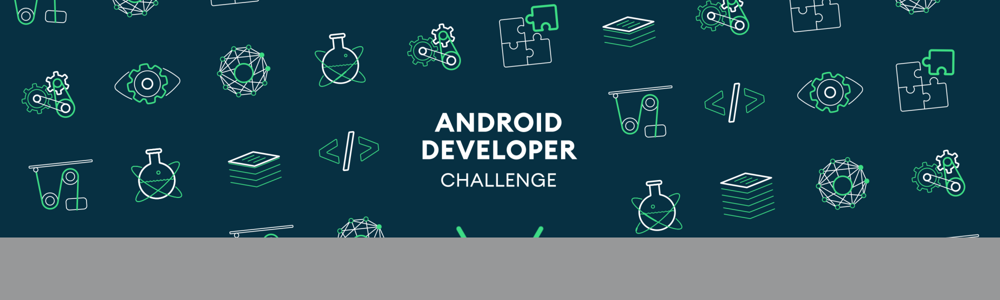

**using the tag \#AndroidDevChallenge\***

**Personal Fitness Trainer **

*We are developing a app that helps user get fit and live longer.
Training programs need to be individualized according to individuals and
their progress. Personal trainers are expensive and synchronizing with
their time is impossible. Using this app, indivduals can work towards
improving health at home or public gyms.*

*Strength coaches and experts will set the time and exercise routine and
update the program according to progress.*

*Health and longevity are dependent on muscle mass and strength. Ageing
induces sarcopenia. Getting strong and muscular is not a easy task. The
work done in this project will optimize the strength and muscle gain
using weight traning. Regular performance of weight training induces
hypertrophy, that makes muscles grow bigger. If the training is
performed under timmed conditions the gains are exponential. The form of
activity is important to avoid injuries and target the right muscle
groups.*

*By analysing live exercise activity and introducing a timing event for
actions the fitness development will be optimized. The inferences run on
the device for privacy and timing accuracy of event generation. While
lifting heavy load jitter or delay is not tolerated and could lead to
further injuries. *

**Tell us how you plan on bringing it to life. **

*Describe where your project is, how you could use Google's help in the
endeavor, and how you plan on using On-Device ML technology to bring the
concept to life. The best submissions have a great idea combined with a
concrete path of where you plan on going, which should include: *

-   *(1) We have collected videos of athletes perfroming the actions and
    > have analyzed them. Studying the GAIT*

-   *(2) Posenet and 3d pose should be optimized on android and we need
    > google to use it.*

-   *(3) Dec 2019, working on poses and exercises. January 2020 the app
    > will be built using the models developed. This will include event
    > generation for timings. February, we will work with expert
    > researchers and fitness coaches to finetune the apps. The app can
    > be used for research about resistance training and timeunder
    > tension.*

**Tell us about you. **

I have worked on software development for last 28 years. Last few years
I have developed inference systems for real time applications.

**Next steps. **

-   Be sure to include this cover letter in your GitHub repository

-   Your GitHub repository should be tagged \#AndroidDevChallenge

-   Don't forget to include other items in your GitHub repository to
    > help us evaluate your submission; you can include prior projects
    > you\'ve worked on, sample code you\'ve already built for this
    > project, or anything else you think could be helpful in evaluating
    > your concept and your ability to build it

-   [**[The final step is to fill out this form to officially submit
    > your proposal.
    > ]{.underline}**](https://docs.google.com/forms/d/e/1FAIpQLSe43koQL33IzgxXQl29Ex3AhFuqd4hQzxLiXREqwRkDGtx1vA/viewform?usp=sf_link)
